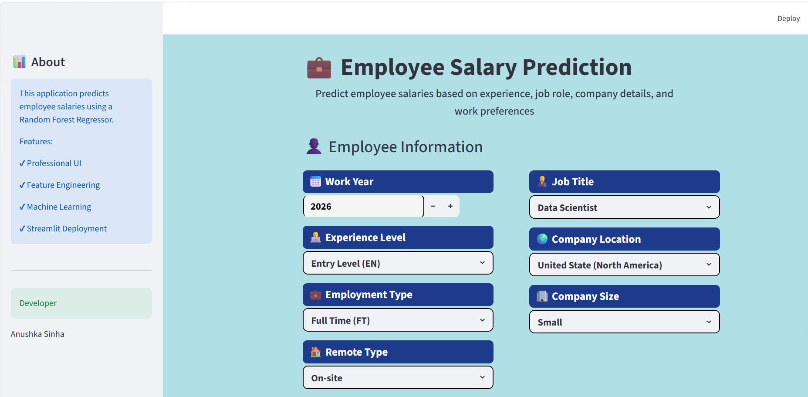
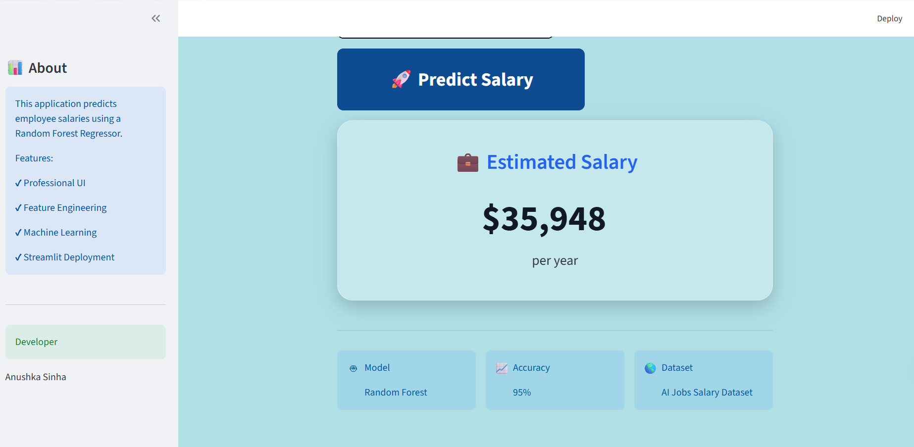

# Employee-Salary-Prediction
Machine Learning project that predicts employee salaries using experience, job role, company details, and work location.
# 💼 Employee Salary Prediction using Machine Learning

<p align="center">


</p>

## 📌 Overview

Employee Salary Prediction is an end-to-end Machine Learning application that estimates the annual salary of an employee based on professional and organizational attributes.

The project demonstrates the complete ML workflow—from data preprocessing and feature engineering to model training and deployment through a modern Streamlit web application.

This project was developed to strengthen practical Machine Learning skills while building a recruiter-ready portfolio project.

---

## 🚀 Live Demo

🔗 **Coming Soon**

(Deploy using Streamlit Community Cloud)

---

## 📷 Application Preview

> Add screenshots here after deployment.

### Home Page


### Prediction Result



---

# ✨ Features

- 📈 Predict employee salary instantly
- 🤖 Random Forest Regression model
- 🏢 Company and employee-based prediction
- 🌍 Multiple company locations supported
- 🏠 Remote / Hybrid / On-site work modes
- 📊 Feature Engineering
- 🎨 Modern Streamlit UI
- ⚡ Interactive dashboard
- 📱 Responsive design

---

# 🧠 Machine Learning Pipeline

```
Dataset
      │
      ▼
Data Cleaning
      │
      ▼
Feature Engineering
      │
      ▼
Encoding
      │
      ▼
Train-Test Split
      │
      ▼
Random Forest Regressor
      │
      ▼
Model Evaluation
      │
      ▼
Model Saving (.pkl)
      │
      ▼
Streamlit Deployment
```

---

# 📂 Dataset

**Dataset Used**

AI Jobs Salary Dataset

### Features

| Feature | Description |
|----------|-------------|
| Work Year | Employment year |
| Experience Level | Entry, Mid, Senior, Executive |
| Employment Type | Full-Time, Part-Time, Contract, Freelance |
| Job Title | Employee designation |
| Company Location | Country of employer |
| Company Size | Small, Medium, Large |
| Remote Type | On-site, Hybrid, Remote |
| Experience Years | Engineered feature |
| Company Region | Engineered feature |
| Company Size Score | Engineered feature |

### Target Variable

- Salary (USD)

---

# ⚙️ Feature Engineering

The project includes custom engineered features to improve prediction performance.

- Experience Years
- Company Region
- Remote Type
- Company Size Score

These engineered features provide additional information to the model beyond the original dataset.

---

# 🤖 Machine Learning Model

Algorithm Used

- Random Forest Regressor

Why Random Forest?

- Handles non-linear relationships
- High prediction accuracy
- Less prone to overfitting
- Works well with categorical features after encoding

---

# 🛠️ Technologies Used

| Technology | Purpose |
|------------|---------|
| Python | Programming Language |
| Pandas | Data Manipulation |
| NumPy | Numerical Computing |
| Scikit-Learn | Machine Learning |
| Joblib | Model Serialization |
| Streamlit | Web Application |
| Matplotlib | Visualization |

---

# 📊 Workflow

```
Data Collection
      ↓
Data Cleaning
      ↓
Feature Engineering
      ↓
Encoding
      ↓
Model Training
      ↓
Model Evaluation
      ↓
Save Model (.pkl)
      ↓
Streamlit Web App
      ↓
Deployment
```

---

# 📁 Project Structure

```
Employee_Salary_Prediction/
│
├── app.py
├── employee_salary_prediction.pkl
├── Employee_Salary_Prediction.ipynb
├── salaries.csv
├── requirements.txt
├── README.md
|── Home.png
|── prediction.png
│
└── .gitignore
```

---

# ▶️ Installation

Clone the repository

```bash
git clone https://github.com/sinhaanushka/Employee-Salary-Prediction.git
```

Go to project directory

```bash
cd Employee-Salary-Prediction
```

Install dependencies

```bash
pip install -r requirements.txt
```

Run the application

```bash
streamlit run app.py
```

---

# 🎯 Sample Prediction

| Input | Value |
|--------|-------|
| Experience | Senior Level |
| Employment Type | Full-Time |
| Job Role | Data Scientist |
| Company Size | Large |
| Remote Type | Remote |
| Location | United States |

### Output

```
Estimated Salary

$158,000 per year
```

---

# 📈 Future Improvements

- Salary confidence interval
- PDF report generation
- Interactive visualizations
- Salary comparison dashboard
- Explainable AI (SHAP)
- Docker deployment
- Cloud deployment

---


# 👩‍💻 Developer

**Anushka Sinha**

B.Tech CSE (AI & ML)

Passionate about Artificial Intelligence, Machine Learning, Data Science and Open Source.

GitHub: https://github.com/sinhaanushka

LinkedIn: https://www.linkedin.com/in/anushka-sinha-581126323/

---

# ⭐ Support

If you found this project useful,

⭐ Star of this repository

It motivates me to build more AI & Machine Learning projects.

---
